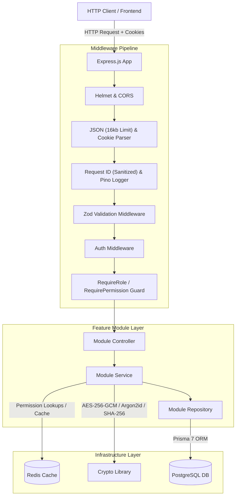
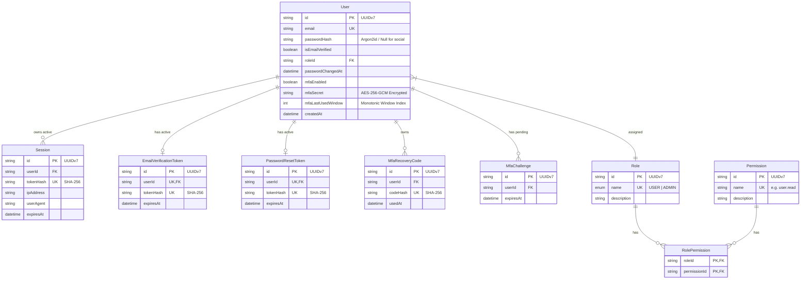
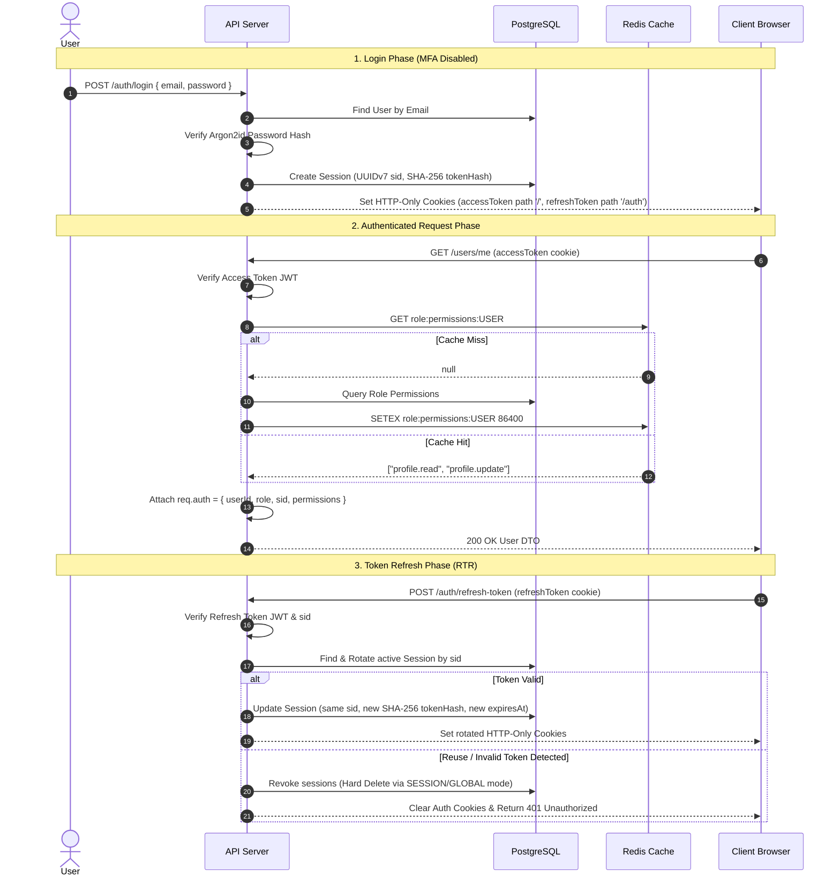
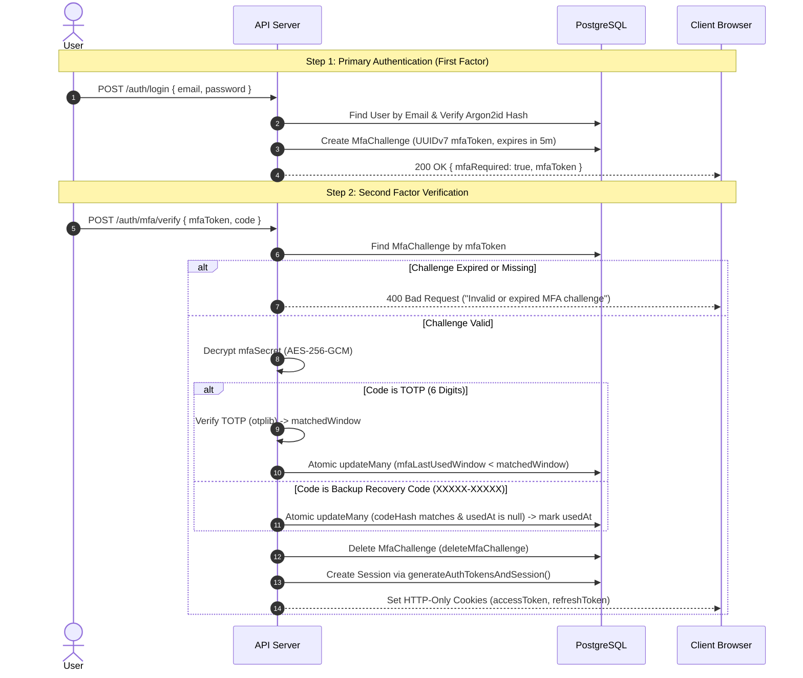
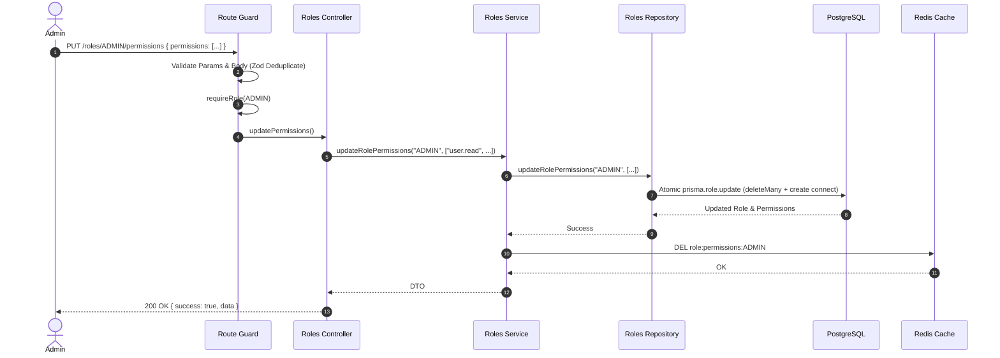

# Architecture & System Design — AuthSphere

This document provides a comprehensive overview of **AuthSphere's** system architecture, data models, component interactions, and end-to-end data/user flows. For specific architectural trade-offs, historical context, and design decisions, refer to [Engineering-Decisions.md](./Engineering-Decisions.md).

---

## 1. System Overview & Monorepo Design

AuthSphere is built as a production-grade, multi-package monorepo managed via npm workspaces.

```text
authsphere/ (Monorepo Root)
├── apps/
│   └── api/                  # Express.js REST API service (Node.js >22)
│       ├── prisma/           # Database schema & migrations
│       └── src/
│           ├── common/       # Global errors, utilities, responses
│           ├── config/       # Single-source env parsing & validation
│           ├── generated/    # Generated Prisma client
│           ├── lib/          # Singleton infrastructure clients (DB, Redis, Logger, Crypto)
│           ├── middlewares/  # Global & request-level middlewares
│           ├── modules/      # Domain feature modules
│           └── types/        # Global Express ambient declarations
├── packages/
│   └── shared/               # Shared domain constants (ROLES, PERMISSIONS) & types
└── docker/                   # Development infrastructure (PostgreSQL, Redis)
```

---

## 2. Layered Component Architecture

Every request traversing AuthSphere passes through a deterministic pipeline across distinct architectural boundaries:



### Layer Responsibilities

| Layer                   | Primary Responsibility                                                                                                      | Architectural Rule                                                                                    |
| ----------------------- | --------------------------------------------------------------------------------------------------------------------------- | ----------------------------------------------------------------------------------------------------- |
| **Middleware Pipeline** | Input parsing (16kb body limit), request tracing/sanitization, schema validation, token verification, RBAC/ABAC guards      | Rejects malformed, oversized, or unauthorized requests before reaching domain controllers.            |
| **Controller**          | HTTP orchestration, extracting pre-validated input, setting/clearing cookies, returning standard JSON DTOs                  | Must contain zero business logic or SQL queries. Calls services.                                      |
| **Service**             | Core domain logic, cross-module orchestration, security decisions, MFA verification, session generation, cache invalidation | Independent of Express `req`/`res`. Throws `AppError` subclasses.                                     |
| **Repository**          | Data access layer using Prisma 7 ORM and database transactions                                                              | Encapsulates all SQL/Prisma operations. Handles `P2002` duplicate errors and executes atomic queries. |
| **Infrastructure**      | Singletons for Database (Prisma + `pg`), Cache (`node-redis`), Logging (Pino), Crypto (Argon2id, AES-256-GCM)               | Instantiated inside `src/lib/` and shared across modules.                                             |

---

## 3. Data Model & Entity Relationship Diagram

The database schema is designed around user identity, active sessions, multi-factor authentication (MFA), role-based access control (RBAC), and single-use verification/reset tokens.



---

## 4. End-to-End Core Flows

### 4.1 Primary Authentication & Token Lifecycle Flow (Standard Login)



### 4.2 Multi-Factor Authentication (MFA) & Two-Step Login Flow

When a user has MFA enabled (`mfaEnabled = true`), primary authentication yields an ephemeral challenge token instead of full session cookies:



### 4.3 Role Permission Management & Cache Invalidation Flow

When an administrator updates permissions assigned to a role, cache consistency is maintained across distributed nodes:



---

## 5. Security & Infrastructure Architecture

### Security & Cryptographic Layers

1. **Password Security**: Argon2id hashing configured with OWASP parameters (64MB memory, 3 iterations, 4 parallelism). Pre-computed dummy password verification prevents timing attacks on missing accounts `[ADR-022, ADR-031]`.
2. **MFA Secret Protection**: TOTP secrets are encrypted at rest using **AES-256-GCM** authenticated encryption (`ivHex:authTagHex:ciphertextHex`). The 32-byte key is derived from `env.MFA_ENCRYPTION_KEY` using SHA-256 `[ADR-040]`.
3. **MFA Replay & Brute-Force Prevention**:
   - **Ephemeral Challenges**: Login with MFA issues a 5-minute single-use `mfaToken` (`MfaChallenge`), preventing direct TOTP brute-forcing against user IDs `[ADR-045]`.
   - **Monotonic Window Tracking**: `mfaLastUsedWindow` integer tracking in DB prevents TOTP code reuse within 30-second windows and locks out preceding windows `[ADR-046]`.
   - **Single-Use Recovery Codes**: Backup codes (`XXXXX-XXXXX`) stored strictly as SHA-256 digests (`codeHash`), consumed via atomic conditional updates (`usedAt: null`) `[ADR-047]`.
   - **Dual-Factor Credential Protection**: Password reset and password change mandate MFA code verification when `mfaEnabled = true` `[ADR-048]`.
4. **Token Security & Transport**:
   - Short-lived JWT Access Tokens (15m) carrying `sub`, `sid`, `role`.
   - Long-lived Refresh Tokens (30d) tied to database sessions. Store only `SHA-256` token hashes `[ADR-012]`.
   - **Refresh Token Rotation (RTR)** with reuse detection revokes sessions immediately upon detecting token replay `[ADR-014]`.
   - Delivered via `httpOnly`, `secure`, `sameSite: "lax"` cookies. Refresh token cookie scoped to path `/auth` (covering `/auth/refresh-token` and `/auth/logout`) `[ADR-033, ADR-042]`.
5. **Input Sanitization & Request Hardening**:
   - Multi-target Zod validation (`ValidationTarget.BODY`, `PARAMS`, `QUERY`) strips undeclared parameters to prevent mass assignment `[ADR-026]`. Array deduplication via Zod `.transform()` normalizes inputs `[ADR-038]`.
   - Explicit `16kb` body size limit on `express.json()` protects against payload memory consumption `[ADR-044]`.
   - `X-Request-Id` header sanitization strips control/newline characters (`\r\n`) and caps length at 128 chars while preserving distributed trace context `[ADR-043]`.

### Infrastructure Resilience & Observability

- **Centralized Session Utility**: `generateAuthTokensAndSession` helper consolidates token signing, hashing, and session creation/rotation `[ADR-039]`.
- **Repository Exception Translation**: Prisma `P2002` unique constraint failures (e.g. concurrent duplicate signups) are caught in the repository layer and rethrown as `AppError("Email already in use", 409)` `[ADR-041]`.
- **Graceful Shutdown**: Intercepts `SIGINT`/`SIGTERM` to close HTTP listeners, drain active connections with a 10s timeout, and disconnect Prisma and Redis concurrently `[ADR-010]`.
- **Fail-Safe Caching**: `redis.isOpen` checks ensure that Redis network outages transparently fallback to PostgreSQL DB queries without crashing requests `[ADR-035]`.
- **Structured Logging**: Pino emits structured JSON logs with correlated `X-Request-Id` headers across request lifecycles `[ADR-009]`.
- **Health Checks**: `/health` actively verifies database and Redis connectivity, returning `200 OK` or `503 Service Unavailable` for container orchestrator probes `[ADR-011]`.
