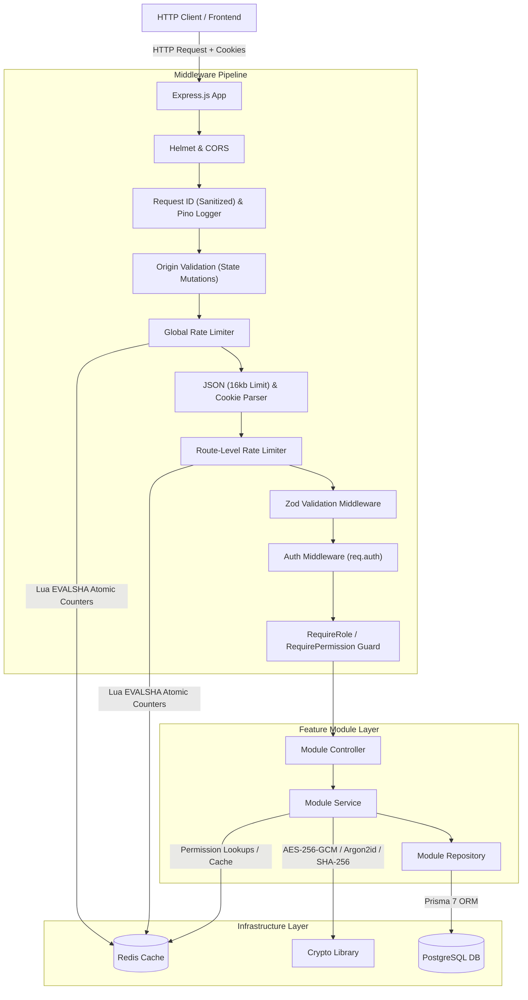
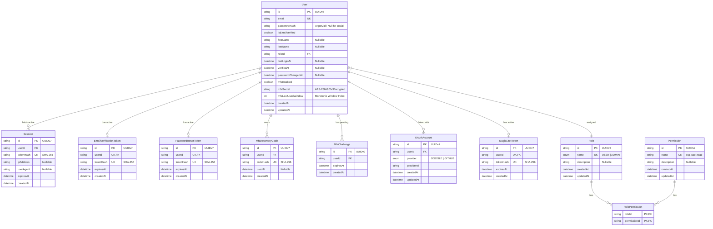
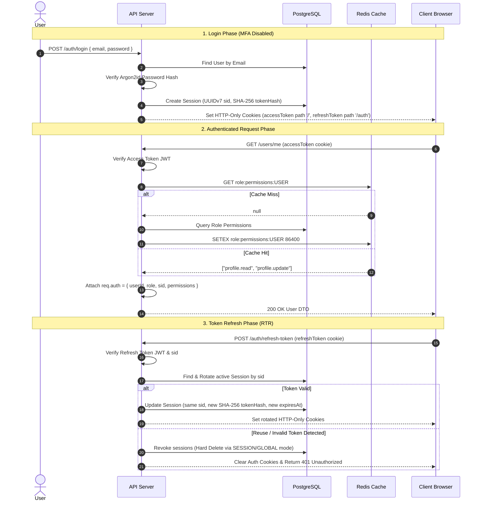
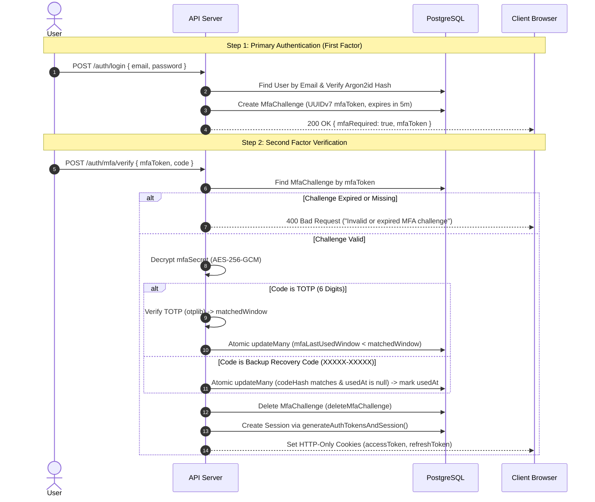
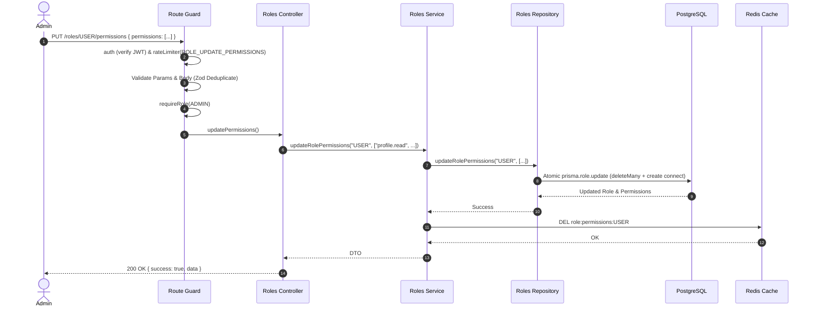
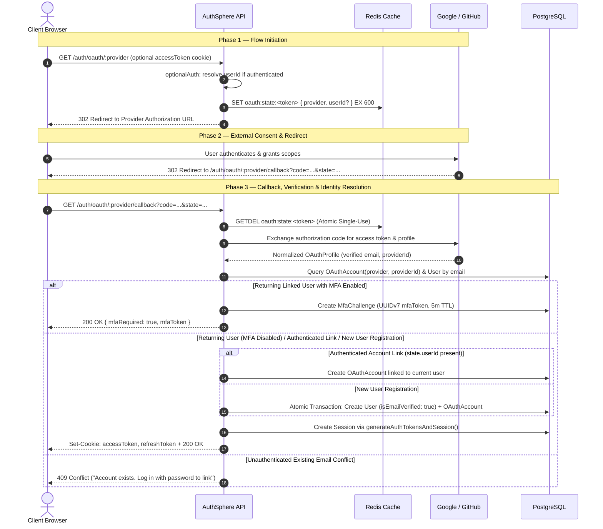
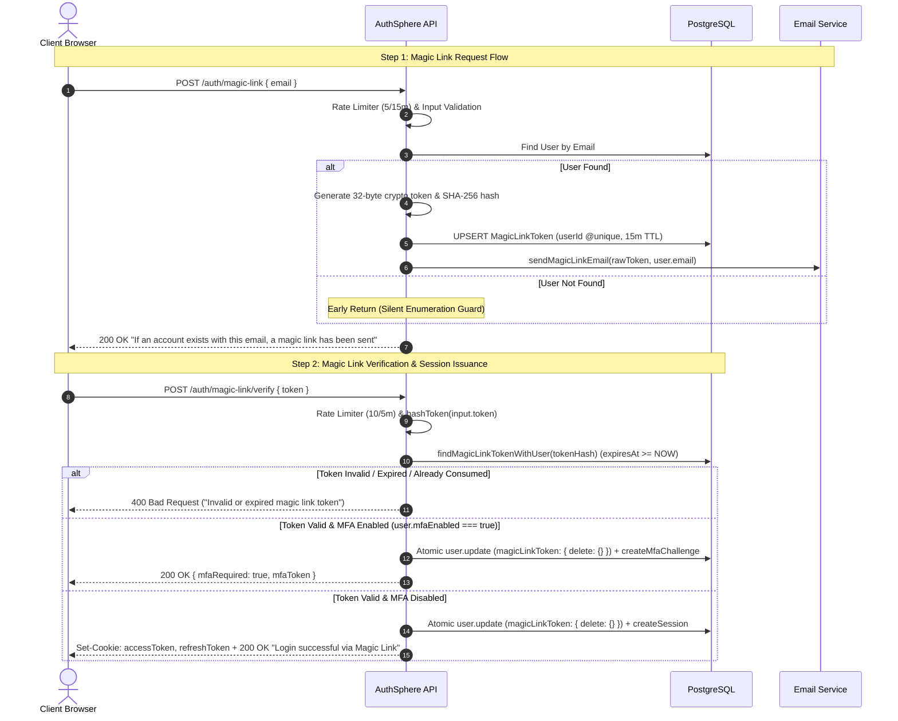

# Architecture & System Design — AuthSphere

This document provides a comprehensive overview of **AuthSphere's** system architecture, data models, component interactions, and end-to-end data/user flows. For specific architectural trade-offs, historical context, and design decisions, refer to [Engineering-Decisions.md](./Engineering-Decisions.md).

---

## 1. System Overview & Monorepo Design

AuthSphere is built as a production-grade, multi-package monorepo managed via npm workspaces.

```text
authsphere/ (Monorepo Root)
├── apps/
│   ├── api/                  # Express.js REST API service (Node.js >22)
│   │   ├── prisma/           # Database schema, migrations, and seed script
│   │   └── src/
│   │       ├── common/       # Global errors, utilities, responses
│   │       ├── config/       # Single-source env parsing & validation
│   │       ├── generated/    # Generated Prisma client
│   │       ├── lib/          # Singleton infrastructure clients (DB, Redis, Logger, Crypto)
│   │       ├── middlewares/  # Global & request-level middlewares
│   │       ├── modules/      # Domain feature modules (auth, roles, users, health, email)
│   │       └── types/        # Global Express ambient declarations
│   └── web/                  # React & Vite frontend application
├── packages/
│   └── shared/               # Shared domain constants (ROLES, PERMISSIONS, OAUTH_PROVIDERS) & types
└── docker/                   # Development infrastructure (PostgreSQL, Redis Compose configurations)
```

---

## 2. Layered Component Architecture

Every request traversing AuthSphere passes through a deterministic pipeline across distinct architectural boundaries:



### Layer Responsibilities

| Layer                   | Primary Responsibility                                                                                                                                          | Architectural Rule                                                                                                         |
| ----------------------- | --------------------------------------------------------------------------------------------------------------------------------------------------------------- | -------------------------------------------------------------------------------------------------------------------------- |
| **Middleware Pipeline** | Request tracing, origin validation on mutations, global and route rate limiting, input parsing (16kb limit), schema validation, token verification, RBAC guards | Rejects malformed, oversized, untrusted-origin, rate-limited, or unauthorized requests before reaching domain controllers. |
| **Controller**          | HTTP orchestration, extracting pre-validated input, setting/clearing cookies, returning standard JSON DTOs                                                      | Must contain zero business logic or SQL queries. Calls services.                                                           |
| **Service**             | Core domain logic, cross-module orchestration, security decisions, MFA verification, session generation, cache invalidation                                     | Independent of Express `req`/`res`. Throws `AppError` subclasses.                                                          |
| **Repository**          | Data access layer using Prisma 7 ORM and database transactions                                                                                                  | Encapsulates all SQL/Prisma operations. Handles `P2002` duplicate errors and executes atomic queries.                      |
| **Infrastructure**      | Singletons for Database (Prisma + `pg`), Cache (`node-redis`), Logging (Pino), Crypto (Argon2id, AES-256-GCM)                                                   | Instantiated inside `src/lib/` and shared across modules.                                                                  |

---

## 3. Data Model & Entity Relationship Diagram

The database schema is designed around user identity, active sessions, multi-factor authentication (MFA), role-based access control (RBAC), and single-use verification/reset tokens.



---

## 4. End-to-End Core Flows

### 4.1 Primary Authentication & Token Lifecycle Flow (Standard Login)



### 4.2 Multi-Factor Authentication (MFA) & Two-Step Login Flow

When a user has MFA enabled (`mfaEnabled = true`), primary authentication yields an ephemeral challenge token instead of full session cookies:



### 4.3 Role Permission Management & Cache Invalidation Flow

When an administrator updates permissions assigned to a non-admin role, cache consistency is maintained across distributed nodes:



### 4.4 OAuth 2.0 Authentication & Identity Resolution Flow

Social login authentication and account linking utilize provider strategies, Redis state validation, and strict conflict guards:



### 4.5 Passwordless Magic Link Authentication Flow

Passwordless authentication provides enumeration-safe token issuance and atomic single-use nested consumption:



---

## 5. Security & Infrastructure Architecture

### Security & Cryptographic Layers

1. **Password Security**: Argon2id hashing configured with OWASP parameters (64MB memory, 3 iterations, 4 parallelism). Pre-computed dummy password verification prevents timing attacks on missing accounts `[ADR-022, ADR-031]`.
2. **MFA Secret Protection**: TOTP secrets are encrypted at rest using **AES-256-GCM** authenticated encryption (`ivHex:authTagHex:ciphertextHex`). The 32-byte key is derived from `env.MFA_ENCRYPTION_KEY` using SHA-256 `[ADR-040]`.
3. **MFA Replay & Brute-Force Prevention**:
   - **Ephemeral Multi-Challenge Architecture**: Login with MFA issues a 5-minute single-use `mfaToken` (`MfaChallenge`), preventing direct TOTP brute-forcing against user IDs while preserving concurrent multi-device/multi-tab login UX `[ADR-045, ADR-057]`.
   - **Monotonic Window Tracking**: `mfaLastUsedWindow` integer tracking in DB prevents TOTP code reuse within 30-second windows and locks out preceding windows `[ADR-046]`.
   - **Single-Use Recovery Codes**: Backup codes (`XXXXX-XXXXX`) stored strictly as SHA-256 digests (`codeHash`), consumed via atomic conditional updates (`usedAt: null`) `[ADR-047]`.
   - **Dual-Factor Credential Protection**: Password reset and password change mandate MFA code verification when `mfaEnabled = true` `[ADR-048]`.
4. **Token Security & Transport**:
   - Short-lived JWT Access Tokens (15m) carrying `sub`, `sid`, `role`.
   - Long-lived Refresh Tokens (30d) tied to database sessions. Store only `SHA-256` token hashes `[ADR-012]`.
   - **Refresh Token Rotation (RTR)** with reuse detection revokes sessions immediately upon detecting token replay `[ADR-014]`.
   - Delivered via `httpOnly`, `secure`, `sameSite: "lax"` cookies. Refresh token cookie scoped to path `/auth` (covering `/auth/refresh-token` and `/auth/logout`) `[ADR-033, ADR-042]`.
5. **OAuth 2.0 & Social Identity Security**:
   - **Provider-Agnostic Strategy**: Strategy interfaces (`OAuthProviderStrategy`) isolate provider APIs and normalize profile payloads `[ADR-059]`. Higher-order controller factories eliminate route boilerplate `[ADR-063]`.
   - **Redis Ephemeral State**: Cryptographic 32-byte state tokens in Redis (10m TTL) consumed atomically via `GETDEL` (`redis.getDel`) prevent CSRF and replay attacks `[ADR-060]`.
   - **Anti-Account Takeover Identity Resolution**: Prohibits unauthenticated auto-linking by email alone; requires explicit credentials to link third-party accounts (`409 Conflict`) `[ADR-061]`.
   - **Mandatory Email Verification**: Enforces `email_verified: true` across providers, resolving private verified GitHub emails via `/user/emails` `[ADR-062]`.
6. **Passwordless Magic Link Security**:
   - **1-1 Token Relation & Prior Link Revocation**: Enforces `userId @unique` on `MagicLinkToken`, automatically invalidating superseded links on re-request `[ADR-064]`.
   - **Atomic Consumption & Dual-Purpose Verification**: Atomically consumes tokens via 1-to-1 nested deletion (`magicLinkToken: { delete: {} }`), automatically marks unverified accounts as verified upon login, and defers expired token cleanup to scheduled jobs `[ADR-065]`.
   - **Universal Account Access**: Enables both password-based and social-login-created users to log in passwordlessly.
   - **Enumeration-Safe Policy**: Requests return identical generic responses regardless of account existence `[ADR-023]`.
7. **Input Sanitization & Request Hardening**:
   - Multi-target Zod validation (`ValidationTarget.BODY`, `PARAMS`, `QUERY`) strips undeclared parameters to prevent mass assignment `[ADR-026]`. Array deduplication via Zod `.transform()` normalizes inputs `[ADR-038]`.
   - Explicit `16kb` body size limit on `express.json()` protects against payload memory consumption `[ADR-044]`.
   - `X-Request-Id` header sanitization strips control/newline characters (`\r\n`) and caps length at 128 chars while preserving distributed trace context `[ADR-043]`.
8. **Rate Limiting & Anti-Abuse**:
   - Multi-tiered Redis-backed rate limiting using atomic Lua scripting (`INCR` + conditional `EXPIRE` + `TTL` in a single `EVALSHA` roundtrip) `[ADR-050]`.
   - Centralized `RATE_LIMIT_POLICIES` dictionary defines per-endpoint quotas and windows. Global layer (100 req/min per IP) protects all routes; route-level policies protect sensitive endpoints (`LOGIN`, `MFA_VERIFY`, `OAUTH_INITIATE`, `OAUTH_CALLBACK`, `MAGIC_LINK_REQUEST`, `MAGIC_LINK_VERIFY`) individually `[ADR-051, ADR-066]`.
   - Dual-key strategy: IP-based keys for unauthenticated endpoints, authenticated `userId`-based keys for protected endpoints to prevent shared-network false positives `[ADR-052]`.
   - IETF-compliant `RateLimit-Limit`, `RateLimit-Remaining`, `RateLimit-Reset`, and `Retry-After` headers on all responses.
   - Fail-open resilience: Redis outages bypass the rate limiter transparently, preventing legitimate traffic from being blocked by infrastructure failures.
9. **Proxy Trust & IP Security**:
   - `TRUST_PROXY` environment variable validated and type-coerced at startup via Zod `.transform()` (supports `boolean`, integer hop count, or subnet arrays) `[ADR-053]`.
   - All client IP resolution uses `req.ip` (Express `proxy-addr` module) instead of manual `X-Forwarded-For` parsing, preventing IP spoofing attacks `[ADR-054]`.
10. **Resource Isolation & Origin Validation**:
    - Evaluates all state-changing HTTP requests (`POST`, `PUT`, `PATCH`, `DELETE`) using a hybrid strategy of unforgeable browser `Sec-Fetch-Site` metadata and normalized `Origin`/`Referer` header checking against `env.FRONTEND_URL` `[ADR-055]`.
    - Fast-paths `same-origin`/`same-site` requests, blocks explicit `cross-site` mutations from untrusted origins, and rejects opaque `Origin: "null"` headers from sandboxed iframe attacks.
    - Deferred body/cookie parsing pipeline placement drops untrusted requests (403) and rate-limited bursts (429) before JSON parsing or memory allocation.
11. **API-Tuned Security Headers**:
    - `helmet()` configured with `crossOriginResourcePolicy: { policy: "cross-origin" }` for cross-domain API accessibility and `xFrameOptions: { action: "deny" }` for strict clickjacking defense `[ADR-056]`.

### Infrastructure Resilience & Observability

- **Centralized Session Utility**: `generateAuthTokensAndSession` helper consolidates token signing, hashing, and session creation/rotation `[ADR-039]`.
- **Repository Exception Translation**: Prisma `P2002` unique constraint failures (e.g. concurrent duplicate signups) are caught in the repository layer and rethrown as `AppError("Email already in use", 409)` `[ADR-041]`.
- **Last-Admin Demotion Guard**: Mutexes on the `ADMIN` role record via interactive Prisma transaction row-locking, preventing write-skew concurrency bugs that could demote the final system administrator `[ADR-067]`.
- **Graceful Shutdown**: Intercepts `SIGINT`/`SIGTERM` to close HTTP listeners, drain active connections with a 10s timeout, and disconnect Prisma and Redis concurrently `[ADR-010]`.
- **Fail-Safe Caching**: `redis.isOpen` checks ensure that Redis network outages transparently fallback to PostgreSQL DB queries without crashing requests `[ADR-035]`.
- **Structured Logging**: Pino emits structured JSON logs with correlated `X-Request-Id` headers across request lifecycles `[ADR-009]`.
- **Health Checks**: `/health` actively verifies database and Redis connectivity, returning `200 OK` or `503 Service Unavailable` for container orchestrator probes `[ADR-011]`.
