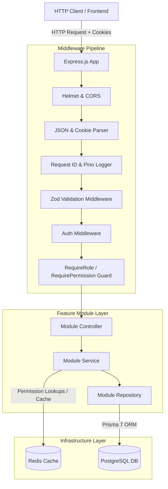
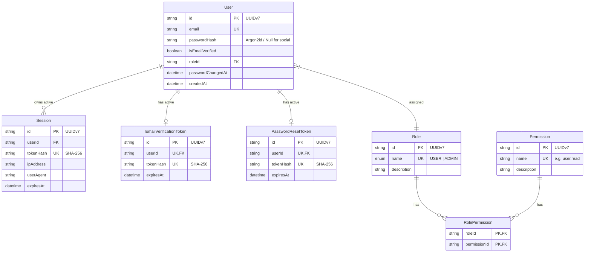
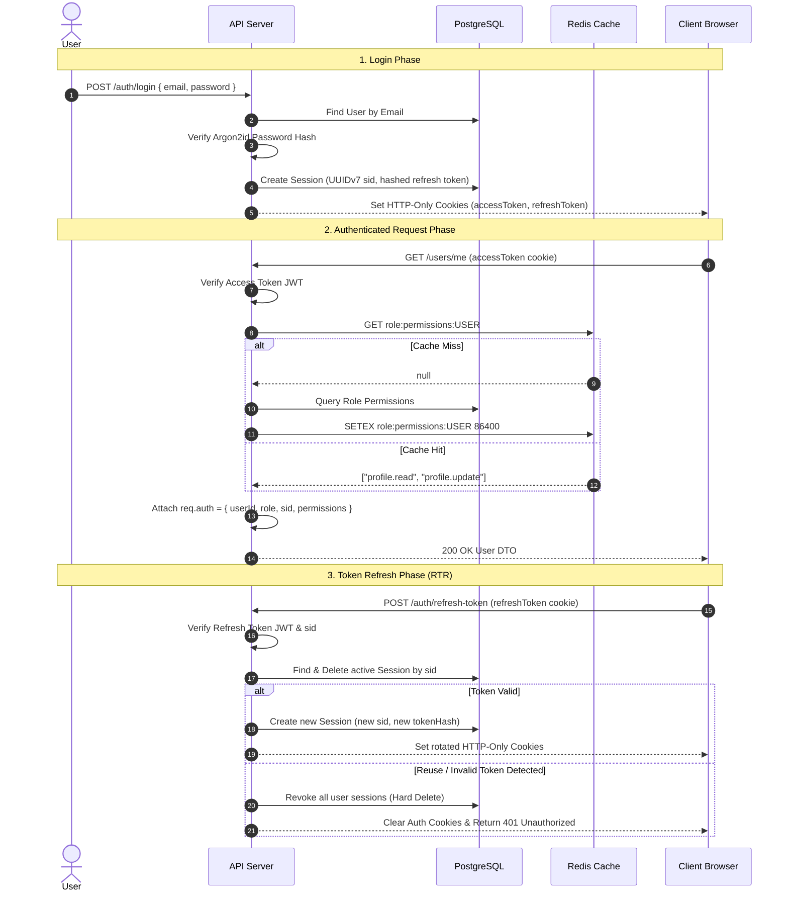
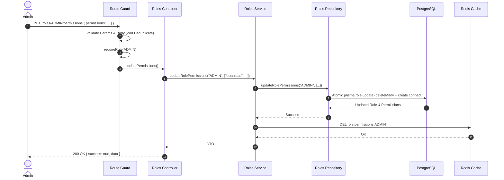

# Architecture & System Design — AuthSphere

This document provides a comprehensive overview of **AuthSphere's** system architecture, data models, component interactions, and end-to-end data/user flows. For specific architectural trade-offs, historical context, and design decisions, refer to [Engineering-Decisions.md](./Engineering-Decisions.md).

---

## 1. System Overview & Monorepo Design

AuthSphere is built as a production-grade, multi-package monorepo managed via npm workspaces.

```text
authsphere/ (Monorepo Root)
├── apps/
│   └── api/                  # Express.js REST API service (Node.js >22)
│       ├── prisma/           # Database schema & migrations
│       └── src/
│           ├── common/       # Global errors, utilities, responses
│           ├── config/       # Single-source env parsing & validation
│           ├── generated/    # Generated Prisma client
│           ├── lib/          # Singleton infrastructure clients (DB, Redis, Logger)
│           ├── middlewares/  # Global & request-level middlewares
│           ├── modules/      # Domain feature modules
│           └── types/        # Global Express ambient declarations
├── packages/
│   └── shared/               # Shared domain constants (ROLES, PERMISSIONS) & types
└── docker/                   # Development infrastructure (PostgreSQL, Redis)
```

---

## 2. Layered Component Architecture

Every request traversing AuthSphere passes through a deterministic pipeline across distinct architectural boundaries:



### Layer Responsibilities

| Layer | Primary Responsibility | Architectural Rule |
|---|---|---|
| **Middleware Pipeline** | Input parsing, request tracing, schema validation, token verification, RBAC/ABAC guards | Rejects malformed or unauthorized requests before reaching domain controllers. |
| **Controller** | HTTP orchestration, extracting pre-validated input, returning standard JSON DTOs | Must contain zero business logic or SQL queries. Calls services. |
| **Service** | Core domain logic, cross-module orchestration, security decisions, cache management | Independent of Express `req`/`res`. Throws `AppError` subclasses. |
| **Repository** | Data access layer using Prisma 7 ORM and database transactions | Encapsulates all SQL/Prisma operations. Executes single atomic queries where possible. |
| **Infrastructure** | Singletons for Database (Prisma + `pg`), Cache (`node-redis`), Logging (Pino) | Instantiated inside `src/lib/` and shared across modules. |

---

## 3. Data Model & Entity Relationship Diagram

The database schema is designed around user identity, active sessions, role-based access control (RBAC), and single-use verification/reset tokens.



---

## 4. End-to-End Core Flows

### 4.1 Authentication & Token Lifecycle Flow



### 4.2 Role Permission Management & Cache Invalidation Flow

When an administrator updates permissions assigned to a role, cache consistency is maintained across distributed nodes:



---

## 5. Security & Infrastructure Architecture

### Security Layers

1. **Password Security**: Argon2id hashing configured with OWASP parameters (64MB memory, 3 iterations, 4 parallelism). Dummy password verification prevents timing attacks on missing accounts `[ADR-022]`.
2. **Token Security**:
   - Short-lived JWT Access Tokens (15m) carrying `sub`, `sid`, `role`.
   - Long-lived Refresh Tokens (7d) tied to database sessions. Store only `SHA-256` token hashes `[ADR-012]`.
   - **Refresh Token Rotation (RTR)** with reuse detection revokes sessions immediately upon detecting token replay `[ADR-014]`.
3. **Transport Security**: Delivered strictly via `httpOnly`, `secure`, `sameSite: "lax"` cookies. Refresh token cookie scoped exclusively to `/auth/refresh-token` `[ADR-033]`.
4. **Input Sanitization**: Multi-target Zod validation (`ValidationTarget.BODY`, `PARAMS`, `QUERY`) strips undeclared parameters to prevent mass assignment vulnerabilities `[ADR-026]`. Automatic array deduplication via Zod `.transform()` normalizes inputs `[ADR-038]`.

### Infrastructure Resilience & Observability

- **Graceful Shutdown**: Intercepts `SIGINT`/`SIGTERM` to close HTTP listeners, drain active connections with a 10s timeout, and disconnect Prisma and Redis concurrently `[ADR-010]`.
- **Fail-Safe Caching**: `redis.isOpen` checks ensure that Redis network outages transparently fallback to PostgreSQL DB queries without crashing requests `[ADR-035]`.
- **Structured Logging**: Pino emits structured JSON logs with correlated `X-Request-Id` headers across request lifecycles `[ADR-009]`.
- **Health Checks**: `/health` actively verifies database and Redis connectivity, returning `200 OK` or `503 Service Unavailable` for container orchestrator probes `[ADR-011]`.
