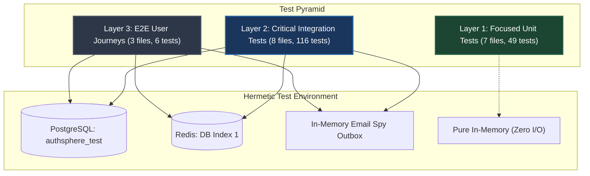
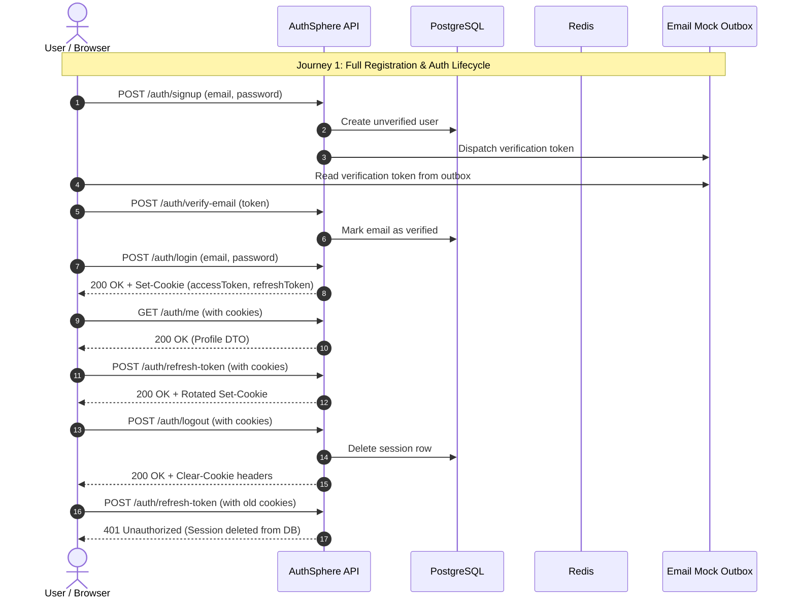

# AuthSphere Testing — Architecture, Strategy & Execution Reference

> Technical reference for AuthSphere's automated testing architecture, hermetic test environment, test pyramid, security invariant verification, and developer workflow.

---

## Table of Contents

1. [Testing Philosophy & Monorepo Strategy](#1-testing-philosophy--monorepo-strategy)
2. [Test Pyramid Architecture & Verification Scopes](#2-test-pyramid-architecture--verification-scopes)
3. [Hermetic Test Infrastructure & Isolation](#3-hermetic-test-infrastructure--isolation)
4. [Modular Helpers, Spies & Entity Factories](#4-modular-helpers-spies--entity-factories)
5. [Security Invariant & Resilience Verification Matrix](#5-security-invariant--resilience-verification-matrix)
6. [Test Coverage Metrics & Quality Gates](#6-test-coverage-metrics--quality-gates)
7. [Developer Workflow & CLI Reference](#7-developer-workflow--cli-reference)
8. [Directory & File Reference Map](#8-directory--file-reference-map)
9. [Troubleshooting & Testing Invariants](#9-troubleshooting--testing-invariants)

---

## 1. Testing Philosophy & Monorepo Strategy

AuthSphere's testing suite is engineered around **high-signal verification, modular architecture, and DRY design patterns** rather than vanity coverage metrics. It directly proves core security invariants, authentication lifecycles, and infrastructure resilience under production-identical routing `[ADR-070]`.

### Core Testing Invariants

- **Zero External Network Egress:** No Internet or third-party service dependencies. All third-party dispatches (e.g. transactional emails) are intercepted in-memory with inspectable token accessors, with I/O strictly isolated to dedicated local/containerized PostgreSQL and Redis test instances `[ADR-070]`.
- **Deterministic State Transitions:** Tests execute against dedicated PostgreSQL (`authsphere_test`) and Redis (DB Index 1) test instances with atomic cascade cleanups between test suites `[ADR-003, ADR-070]`.
- **Pure In-Memory Fast-Path:** Unit tests execute 100% in-memory without initiating database or Redis connections, completing in milliseconds `[ADR-070]`.
- **Strict Configuration Separation:** Test configuration (`.env.test`) is isolated from development (`.env`) and production environments `[ADR-003]`.
- **Serial Execution Reliability:** Test files execute serially (`fileParallelism: false`) to eliminate state leakage, cross-test race conditions, and database deadlocks `[ADR-070]`.

```text
Suite Status: 18 test files (100% passing)
Total Tests:  171 passed (171 tests total)
Architecture: Streamlined, DRY, Modular (7 Unit, 8 Integration, 3 E2E)
Framework:    Vitest 4.x + Supertest 7.x + V8 Coverage
Runtime:      Node.js >22 ESM
```

---

## 2. Test Pyramid Architecture & Verification Scopes

The suite is structured into three practical, consolidated layers, establishing deep confidence from pure cryptographic primitives up to stateful customer journeys:



### Layer 1: Focused Unit Tests (7 Files, 49 Tests — Pure In-Memory)

Fast, pure-function tests executing in microseconds without external I/O, database, or Redis dependencies:

| Test File                            | Verification Scope                                 | Invariants Verified                                                                                                                                                         |
| :----------------------------------- | :------------------------------------------------- | :-------------------------------------------------------------------------------------------------------------------------------------------------------------------------- |
| `tests/unit/crypto.test.ts`          | Cryptography, JWT, Password, MFA & Recovery Tokens | Argon2id OWASP compliance, symmetric HS256 JWT sign/verify, AES-256-GCM symmetric encryption, 32-byte hex entropy `[ADR-013, ADR-014, ADR-031, ADR-040]`.                   |
| `tests/unit/security.test.ts`        | RFC 6238 TOTP & Request ID Middleware              | Base32 secret generation, HMAC-SHA1 6-digit window validation, UUIDv7 request ID tracking, and header sanitization `[ADR-043, ADR-045]`.                                    |
| `tests/unit/validation.test.ts`      | Zod Boundary Schemas & Duration Parsers            | Email normalization, password complexity, UUIDv7 params, pagination offsets, and human-readable time conversion `[ADR-017, ADR-026, ADR-038]`.                              |
| `tests/unit/openapi.test.ts`         | OpenAPI 3.1 Spec & Express Route Parity            | Document generation, cookie security schemes, and 1:1 bidirectional Express router parity invariant `[ADR-071]`.                                                            |
| `tests/unit/email-worker.test.ts`    | Email Worker Job Processing & Provider Delegation  | HTML template rendering across all email types, provider delegation, error propagation, and unrecoverable failure detection `[ADR-072, ADR-073, ADR-075]`.                  |
| `tests/unit/email-queue.test.ts`     | BullMQ Queue Producer Operations                   | Type-safe enqueue helpers, payload contract validation, and correct job type routing `[ADR-072]`.                                                                           |
| `tests/unit/resend-provider.test.ts` | Resend Provider Adapter & Error Normalization      | Message ID dispatch, permanent error classification (validation/domain), transient error classification (rate limits/server), and transport exception bubbling `[ADR-073]`. |

### Layer 2: Critical Integration Tests (8 Files, 116 Tests)

End-to-end HTTP pipeline tests traversing Express routing, middleware, controllers, services, repositories, PostgreSQL, and Redis:

| Domain                  | Test File                                                | Primary Invariants Verified                                                                                                                                                                                                                                           |
| :---------------------- | :------------------------------------------------------- | :-------------------------------------------------------------------------------------------------------------------------------------------------------------------------------------------------------------------------------------------------------------------- |
| **Authentication**      | `tests/integration/auth/auth.test.ts`                    | Email verification token dispatch, unverified user blocking (403), refresh token rotation (RTR), automatic reuse detection, single-use magic links, password resets with session revocation, immutable security event logging `[ADR-014, ADR-027, ADR-065, ADR-069]`. |
| **RBAC & Admin Guard**  | `tests/integration/authorization/rbac.test.ts`           | Role hierarchy enforcement (`ADMIN` vs `USER`), self-demotion block (403), last-admin demotion prevention, `requireSelfOrPermission` guards, and 403 Forbidden responses `[ADR-035, ADR-036, ADR-067]`.                                                               |
| **MFA**                 | `tests/integration/mfa/mfa.test.ts`                      | Ephemeral challenge tokens (`mfaToken`), monotonic window tracking, recovery code single-use invalidation, re-use lockout `[ADR-045, ADR-046, ADR-047, ADR-057]`.                                                                                                     |
| **OAuth 2.0**           | `tests/integration/oauth/oauth-service.test.ts`          | Ephemeral state tokens in Redis (10m TTL), code exchange, anti-account-takeover conflict guards (`409 Conflict`), authenticated social account linking `[ADR-059, ADR-060, ADR-061]`.                                                                                 |
| **Active Sessions**     | `tests/integration/sessions/sessions.test.ts`            | Metadata introspection (`GET /sessions`), sensitive token hash omission, foreign session revocation defense (403 Forbidden), cookie clearing on self-revocation `[ADR-068]`.                                                                                          |
| **Roles & Permissions** | `tests/integration/roles/roles.test.ts`                  | Dynamic permission assignment (`PUT /roles/:name/permissions`), admin role immutable protection, Redis permission cache invalidation `[ADR-035, ADR-036]`.                                                                                                            |
| **Security Middleware** | `tests/integration/security/security-middleware.test.ts` | Hybrid CORS & `Sec-Fetch-Site` origin protection, Redis-backed fixed-window rate limiting with IETF headers, Helmet headers (`HSTS`, `CSP`, `X-Frame-Options: DENY`), structured JSON error responses `[ADR-050, ADR-055, ADR-056]`.                                  |
| **Resilience**          | `tests/integration/resilience/resilience.test.ts`        | Fail-open rate limiter when Redis disconnects, race-condition resistance on token rotation, Last-Admin demotion protection via row-locking, cleanup helper invariant verification, and Prisma P2002 duplicate translation `[ADR-041, ADR-067, ADR-070]`.              |

### Layer 3: End-to-End User Journeys (3 Files, 6 Tests)

Multi-step customer workflows verifying state preservation and invalidation across distributed subsystems:



- **`tests/e2e/auth-lifecycle.test.ts`**:
  - **Journey 1**: Signup $\rightarrow$ Verification email outbox intercept $\rightarrow$ Email verification $\rightarrow$ Login $\rightarrow$ Protected profile inspection $\rightarrow$ Refresh token rotation $\rightarrow$ Logout $\rightarrow$ Assert cookie clearing and refresh rejection.
  - **Journey 2**: Enable MFA $\rightarrow$ Live TOTP code validation $\rightarrow$ 10 recovery codes issued $\rightarrow$ Logout $\rightarrow$ Login returning `mfaRequired: true` $\rightarrow$ Fulfill TOTP challenge $\rightarrow$ Profile access.
  - **Journey 3**: Forgot password $\rightarrow$ Token extraction $\rightarrow$ Password reset $\rightarrow$ Immediate revocation of prior sessions in PostgreSQL $\rightarrow$ Rejection of subsequent refresh requests.
- **`tests/e2e/session-management.test.ts`**:
  - Dual-device login (Desktop + Mobile) $\rightarrow$ Session introspection via `/sessions` (`isCurrent` flags) $\rightarrow$ Remote revocation of mobile session from desktop $\rightarrow$ Desktop remains authenticated while mobile refresh fails with 401 $\rightarrow$ Self-revocation clears cookies.
- **`tests/e2e/admin-authorization.test.ts`**:
  - Standard user promotes to `ADMIN` $\rightarrow$ Accesses privileged administrative endpoints (`/roles`) $\rightarrow$ Admin is demoted back to `USER` $\rightarrow$ Next request rejected with `403 Forbidden`.

---

## 3. Hermetic Test Infrastructure & Isolation

### Dedicated Database & Redis Instances

Testing never touches development or production state `[ADR-003]`:

```text
PostgreSQL Test DB:  postgresql://postgres:<TEST_DB_PASSWORD>@localhost:5432/authsphere_test
Redis Test DB Index: redis://localhost:6379/1
```

`apps/api/src/config/env.ts` intercepts `NODE_ENV === "test"` and dynamically loads `.env.test`:

```typescript
const envFile =
  process.env.NODE_ENV === "test" ? "../../.env.test" : "../../.env";
dotenv.config({ path: new URL(envFile, import.meta.url) });
```

### Deterministic Database Reset (`cleanTestState`)

To ensure clean test runs without re-running expensive Prisma migrations between files, `tests/helpers/db.ts` executes an atomic PostgreSQL `TRUNCATE ... CASCADE` across all mutable user entities while preserving seeded RBAC tables, and flushes Redis test database #1 `[ADR-070]`:

```typescript
export async function cleanTestState() {
  await cleanDatabase();
  await flushRedis();
}
```

### Automated Baseline Role Seeding (`ensureBaselineSeed`)

`tests/helpers/db.ts` provides a self-healing baseline seeding utility that verifies `USER` and `ADMIN` roles and system permissions exist before running test suites, eliminating manual `prisma:seed` dependencies during CI/CD runs.

### In-Memory Email Spy Outbox

AuthSphere decouples automated testing from third-party email delivery services (e.g. Resend, Nodemailer, AWS SES). In `tests/setup.ts`, the asynchronous BullMQ email queue (`email.queue.js`) is globally mocked using Vitest spies `[ADR-070, ADR-072]`:

```typescript
vi.mock("../src/modules/email/email.queue.js", async () => {
  const { emailQueueMocks } = await import("./helpers/email.js");
  return emailQueueMocks;
});
```

Test files consume strongly typed helper accessors to inspect token payloads directly from memory:

```typescript
const verificationEmail = getLastSentVerificationEmail();
expect(verificationEmail?.token).toBeDefined();

const magicLink = getLastSentMagicLinkEmail();
const resetToken = getLastSentForgotPasswordEmail();
```

---

## 4. Modular Helpers, Spies & Entity Factories

All reusable testing utilities reside under `apps/api/tests/helpers/` and are re-exported via a unified barrel export (`tests/helpers/index.ts`):

| Helper               | File                   | Purpose                                                                                                                                                                                                                      |
| :------------------- | :--------------------- | :--------------------------------------------------------------------------------------------------------------------------------------------------------------------------------------------------------------------------- |
| **Barrel Export**    | `helpers/index.ts`     | Unified, modular export point for all test helpers, factories, singletons, and lifecycle resets.                                                                                                                             |
| **Database & Cache** | `helpers/db.ts`        | Exports `prisma` client, `redis` client, `cleanDatabase()`, `flushRedis()`, `cleanTestState()`, and `ensureBaselineSeed()` auto-seeding guard.                                                                               |
| **Email Outbox**     | `helpers/email.ts`     | Captures sent emails into an in-memory outbox (`emailQueueMocks`, `getLastSentVerificationEmail`, `getLastSentForgotPasswordEmail`, `getLastSentMagicLinkEmail`, `getLastSentSecurityNotificationEmail`, `resetEmailMocks`). |
| **Entity Factories** | `helpers/factories.ts` | Generates persisted test entities with sensible defaults and cached Argon2id hashing (`createUser`, `createVerifiedUser`, `createAdmin`, `createMfaUser`, `createOAuthUser`, `createSession`, `createExpiredSession`).       |
| **Auth & App**       | `helpers/auth.ts`      | Express test app singleton (`getTestApp`), cookie parsing (`getAuthCookies`), header formatting (`formatCookieHeader`), and automated test login (`authenticate`, `login`).                                                  |

### Entity Factory Usage Example

```typescript
// Create a verified user with known password (cached Argon2id hash)
const { user, password } = await createVerifiedUser();

// Create an administrator
const { user: admin, password: adminPassword } = await createAdmin();

// Create a user with enabled MFA and known base32 secret
const { user: mfaUser, rawSecret, recoveryCodes } = await createMfaUser();
```

---

## 5. Security Invariant & Resilience Verification Matrix

The test suite explicitly verifies the architectural, cryptographic, and resilience properties specified in `docs/ARCHITECTURE.md` and `docs/Engineering-Decisions.md`:

| Security Invariant                                            | ADR Reference                          | Verified In                                                         | Proof Mechanism                                                                                                                                                                  |
| :------------------------------------------------------------ | :------------------------------------- | :------------------------------------------------------------------ | :------------------------------------------------------------------------------------------------------------------------------------------------------------------------------- |
| **Stateless Access Token vs Stateful Session Invalidation**   | `[ADR-013, ADR-021, ADR-068]`          | `auth.test.ts`, `sessions.test.ts`, `auth-lifecycle.test.ts`        | Deleting session row invalidates subsequent token rotation; unauthenticated calls return 401; logout sends `Expires=1970` cookie-clearing headers.                               |
| **Refresh Token Rotation (RTR) & Reuse Detection**            | `[ADR-014]`                            | `auth.test.ts`, `resilience.test.ts`                                | Valid rotation updates session `tokenHash`; presenting an already-rotated token triggers automatic reuse revocation of all active user sessions.                                 |
| **Ephemeral MFA Challenge & Monotonic Window Replay Defense** | `[ADR-045, ADR-046, ADR-057]`          | `mfa.test.ts`, `auth-lifecycle.test.ts`                             | Primary login yields ephemeral `mfaToken` (5m TTL); TOTP code reuse within 30s window is rejected; recovery codes are strictly single-use (`codeHash`).                          |
| **Anti-Account Takeover & OAuth Identity Resolution**         | `[ADR-059, ADR-060, ADR-061, ADR-062]` | `oauth-service.test.ts`                                             | Single-use state tokens verified atomically via Redis `GETDEL`; existing password accounts conflict (`409 Conflict`) instead of silently auto-linking.                           |
| **Single-Use Magic Link Invalidation & Auto-Verification**    | `[ADR-064, ADR-065]`                   | `auth.test.ts`                                                      | Consuming magic link token deletes the record atomically, auto-marks unverified users as verified (`isEmailVerified: true`), and logs the user in.                               |
| **Last-Admin Demotion Guard with Row-Level Locking**          | `[ADR-067]`                            | `rbac.test.ts`, `resilience.test.ts`, `admin-authorization.test.ts` | Mutexes on `ADMIN` role record via Prisma interactive transaction; concurrent demotions cannot reduce active administrator count below 1 (403 Forbidden).                        |
| **Redis Outage Fail-Open Resilience**                         | `[ADR-035, ADR-050]`                   | `resilience.test.ts`                                                | Disconnecting Redis simulates outage; rate limiters and permission resolvers gracefully fallback to PostgreSQL DB queries without crashing (500).                                |
| **Cross-Origin Mutation & Sec-Fetch-Site Validation**         | `[ADR-055]`                            | `security-middleware.test.ts`                                       | Rejects explicit `cross-site` state mutations from untrusted origins (403 Forbidden) and blocks opaque `Origin: "null"` sandbox attacks.                                         |
| **Multi-Tier Rate Limiting & IETF Header Emission**           | `[ADR-050, ADR-051, ADR-052, ADR-066]` | `security-middleware.test.ts`                                       | Redis-backed fixed-window Lua script rate limits global IP (100/min) and sensitive endpoints (`/auth/login`, `/auth/mfa/verify`); emits `RateLimit-*` and `Retry-After` headers. |
| **Immutable Security Audit Logging**                          | `[ADR-069]`                            | `auth.test.ts`                                                      | Records `LOGIN_SUCCESS`, `LOGIN_FAILED`, `LOGOUT`, `PASSWORD_CHANGED`, `PASSWORD_RESET`; strictly isolates user event trails with descending chronological pagination.           |
| **Test Infrastructure Cleanup & State Invariant**             | `[ADR-070]`                            | `resilience.test.ts`                                                | Directly asserts `cleanTestState()` purges dynamic user records, flushes Redis DB #1, and preserves seeded `USER`/`ADMIN` baseline roles and system permissions.                 |
| **Code-First OpenAPI 3.1 & 1:1 Express Route Parity**         | `[ADR-071]`                            | `openapi.test.ts`                                                   | Validates OpenAPI 3.1 document compilation from runtime Zod schemas, cookie-based security schemes, and strict 1:1 bidirectional parity with Express route stacks.               |

---

## 6. Test Coverage Metrics & Quality Gates

Run code coverage profiling via Vitest V8 engine:

```bash
npm run test:coverage
```

### Module Coverage Breakdown

| Module / Layer                           | Statements | Branches   | Functions  | Lines      |
| :--------------------------------------- | :--------- | :--------- | :--------- | :--------- |
| **`src/modules/email`**                  | **100%**   | **100%**   | **100%**   | **100%**   |
| **`src/lib/jwt`**                        | **100%**   | **100%**   | **100%**   | **100%**   |
| **`src/middlewares/auth.ts`**            | **100%**   | **100%**   | **100%**   | **100%**   |
| **`src/modules/sessions`**               | **100%**   | **100%**   | **100%**   | **100%**   |
| **`src/lib/crypto`**                     | **95.74%** | **100%**   | **100%**   | **95.65%** |
| **`src/common/utils`**                   | **96.66%** | **84.61%** | **100%**   | **96.66%** |
| **`src/modules/oauth/oauth.service.ts`** | **96.92%** | **97.29%** | **100%**   | **96.92%** |
| **`src/common/errors`**                  | **93.33%** | **68.75%** | **100%**   | **92.85%** |
| **`src/modules/users`**                  | **93.75%** | **77.77%** | **100%**   | **93.75%** |
| **`src/middlewares`**                    | **94.23%** | **80.70%** | **92.30%** | **94.17%** |
| **`src/modules/authorization`**          | **93.10%** | **83.33%** | **100%**   | **92.85%** |
| **`src/modules/roles`**                  | **90.32%** | **33.33%** | **100%**   | **90.32%** |
| **`src/modules/health`**                 | **88.88%** | **75.00%** | **100%**   | **88.88%** |
| **`src/modules/auth`**                   | **84.21%** | **65.73%** | **89.87%** | **84.17%** |
| **Overall Suite**                        | **84.39%** | **65.44%** | **91.58%** | **84.41%** |

---

## 7. Developer Workflow & CLI Reference

### Root Workspace Commands

Run directly from the repository root:

```bash
# Run the complete test suite across all layers
npm test

# Run tests in interactive watch mode for TDD
npm run test:watch

# Run tests with V8 code coverage report
npm run test:coverage
```

### Targeted Layer Execution

Target specific layers or test files via Vitest:

```bash
# Run only Layer 1 focused unit tests (instant execution, zero I/O)
npx vitest run tests/unit/

# Run only Layer 2 critical integration tests
npx vitest run tests/integration/

# Run only Layer 3 E2E user journeys
npx vitest run tests/e2e/

# Run a single specific test file
npx vitest run tests/integration/auth/auth.test.ts
npx vitest run tests/e2e/auth-lifecycle.test.ts
```

### Test Database Setup & Migration

If running tests for the first time or after altering the Prisma schema:

```bash
# Apply pending database migrations to the test database
DATABASE_URL="postgresql://postgres:<TEST_DB_PASSWORD>@localhost:5432/authsphere_test" npx prisma migrate deploy

# Optional: Seed system roles and permissions manually via Prisma CLI
# Note: The test suite automatically self-seeds baseline roles & permissions via ensureBaselineSeed() in tests/setup.ts
DATABASE_URL="postgresql://postgres:<TEST_DB_PASSWORD>@localhost:5432/authsphere_test" npx --workspace=@authsphere/api prisma db seed
```

---

## 8. Directory & File Reference Map

```text
apps/api/
├── .env.test                         # Active test environment variables
├── .env.test.example                 # Committed template for testing config
├── vitest.config.ts                  # Vitest runner, V8 coverage & serial configuration
└── tests/
    ├── setup.ts                      # Global hooks, email mocks, baseline auto-seeding, and unit fast-path
    ├── helpers/
    │   ├── index.ts                  # Unified barrel export for all test helpers
    │   ├── auth.ts                   # Express app singleton (getTestApp), cookie helpers & authentication
    │   ├── db.ts                     # cleanTestState(), cleanDatabase(), flushRedis(), ensureBaselineSeed()
    │   ├── email.ts                  # In-memory email outbox spy accessors
    │   └── factories.ts              # Precomputed Argon2id caching & entity factories (User, Session, MFA, OAuth)
    ├── unit/
    │   ├── crypto.test.ts            # Consolidated JWT, Argon2id Password, Token entropy, AES-256 MFA, Recovery codes
    │   ├── openapi.test.ts           # OpenAPI 3.1 spec generation, tags, cookie security schemes, and Express ↔ OpenAPI 1:1 route parity
    │   ├── security.test.ts          # Consolidated TOTP & Request ID tracking
    │   └── validation.test.ts        # Consolidated Schemas & Time duration parsing
    ├── integration/
    │   ├── auth/
    │   │   └── auth.test.ts          # Complete Auth suite (Signup, Login, Logout, Magic Link, Passwords, Refresh, Events)
    │   ├── authorization/
    │   │   └── rbac.test.ts          # RBAC, Admin Guard, Self-Demotion & Last Admin Invariants
    │   ├── mfa/
    │   │   └── mfa.test.ts           # Complete MFA lifecycle suite (Setup, Verify, Disable, Regenerate)
    │   ├── oauth/
    │   │   └── oauth-service.test.ts # OAuth 2.0 flow, state verification & account linking
    │   ├── resilience/
    │   │   └── resilience.test.ts    # Concurrency, constraints, cleanup sanity, and Redis outage fail-open resilience
    │   ├── roles/
    │   │   └── roles.test.ts         # Role permission management & cache invalidation
    │   ├── security/
    │   │   └── security-middleware.test.ts # Headers, Origin validation, Rate limiting, Error handler
    │   └── sessions/
    │       └── sessions.test.ts      # Active session inspection, listing & revocation
    └── e2e/
        ├── admin-authorization.test.ts # Role promotion, escalation & demotion journey
        ├── auth-lifecycle.test.ts      # Full signup, verification, login, MFA & password reset lifecycles
        └── session-management.test.ts  # Multi-device session listing & remote revocation
```

---

## 9. Troubleshooting & Testing Invariants

### 1. OTPLib v13 Secret Length Requirement

- In OTPLib v13, secrets must be at least 16 bytes (32 Base32 characters).
- **Rule:** Never use short arbitrary strings (e.g. `"testsecret"`) when generating test MFA fixtures. Always use `totp.generateSecret()` or 32-character strings `[ADR-045]`.
- Code generation must use `generateSync({ secret })` instead of deprecated `authenticator.generate(secret)`.

### 2. Rate Limiting False Positives (429 in Tests)

- Integration tests simulating consecutive requests from `127.0.0.1` will exhaust IP rate limits if Redis is not cleared between tests `[ADR-050]`.
- **Remedy:** `tests/setup.ts` automatically runs `cleanTestState()` (which flushes Redis) before each integration/E2E test. If making rapid loops within a single test, supply unique simulated IP headers (`X-Forwarded-For: 10.x.x.x`).

### 3. Preserving Seeded Roles During DB Cleanup

- System roles (`USER`, `ADMIN`) and permissions must exist for user factories and RBAC guards to function `[ADR-035, ADR-067]`.
- **Rule:** Never truncate the `roles` or `permissions` tables inside `cleanDatabase()`. Only truncate dynamic user entities (`users`, `sessions`, `security_events`, etc.). `tests/setup.ts` automatically verifies and re-seeds baseline roles if missing via `ensureBaselineSeed()`.

### 4. Cross-Test State Contamination

- If a test passes individually (`npx vitest run <file>`) but fails during full suite execution (`npm test`), the cause is almost always leftover state in PostgreSQL or Redis.
- Automated lifecycle hooks in `tests/setup.ts` invoke `cleanTestState()` before every non-unit test to ensure complete isolation across suites.
